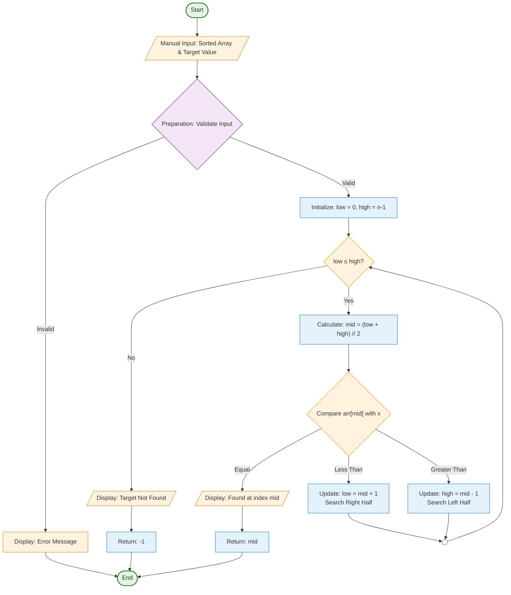

# Binary Search Algorithm Visualizer

## Demo Video/GIF/Screenshot

*(Replace this section with your actual visual materials)*

**Demo GIF:**
<!--  -->

**Screenshots:**
<!-- 
 -->

**Video Demo:** [Link to video recording if available]

## Problem Breakdown & Computational Thinking

### Algorithm Overview
Binary Search is an efficient searching algorithm that finds the position of a target value within a **sorted array**. It works by repeatedly dividing the search interval in half, comparing the middle element with the target value, and eliminating half of the remaining elements at each step.

### Computational Thinking Approach

#### 1. **Decomposition**
Breaking Binary Search into smaller steps:
- **Step 1:** Receive sorted array and target value as input
- **Step 2:** Initialize pointers: `low = 0`, `high = len(array) - 1`
- **Step 3:** While `low <= high`:
  - Calculate `mid = (low + high) // 2`
  - Compare `array[mid]` with target:
    - If equal: return `mid` (found)
    - If less: update `low = mid + 1` (search right half)
    - If greater: update `high = mid - 1` (search left half)
- **Step 4:** Return `-1` if not found

#### 2. **Pattern Recognition**
- Repeated halving of search space (divide-and-conquer)
- Systematic comparison at midpoint
- Progressive narrowing of search boundaries
- Logarithmic time complexity: O(log n)

#### 3. **Abstraction**
**Shown to user:**
- Current search boundaries (low, high pointers)
- Midpoint calculation and comparison
- Visual highlighting of compared elements
- Step-by-step progression through algorithm
- Final result (position or "not found")

**Hidden from user:**
- Underlying array indexing details
- Mathematical floor division
- Loop control variables
- Memory allocation details

#### 4. **Algorithm Design**
**Input → Processing → Output Flow:**

### Flowchart Symbol Key

| Symbol | Name | Used For |
|--------|------|----------|
| `[START]/[END]` | Terminator | Beginning and end of the algorithm |
| `┃ ?? ┃` | Manual Input | User provides sorted array and target |
| `██████` | Process | Algorithm steps and calculations |
| `◇◇◇◇◇◇` | Decision | Branching points and comparisons |
| `▓▓▓▓▓▓` | Display | Showing results/output to user |
| `▒▒▒▒▒▒` | Manual Operation | Special operations or validations |
| `[||]` | Data Storage | Storing variables (low, high, mid) |
| `○──○` | Connector | Looping back to repeat process |

