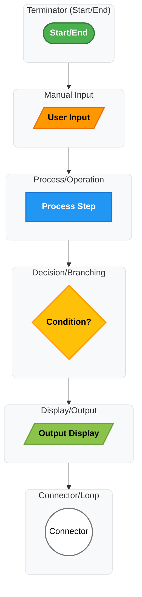
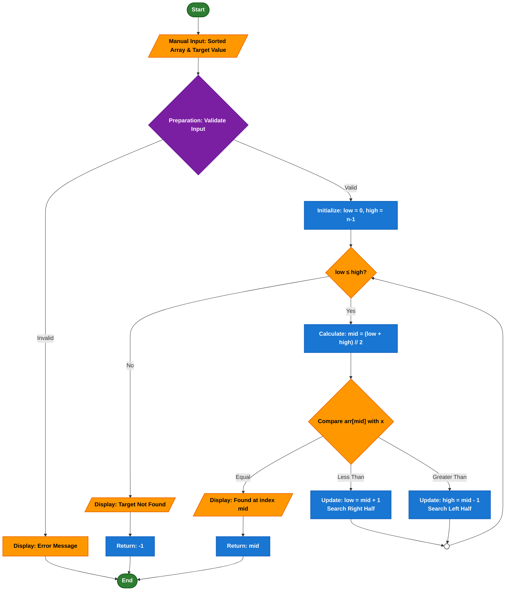

# Binary Search Algorithm Visualizer

## Demo Video/GIF/Screenshot

*(Replace this section with your actual visual materials)*

**Demo GIF:**
<!--  -->

**Screenshots:**
<!-- 
 -->

**Video Demo:** [Link to video recording if available]

## Problem Breakdown & Computational Thinking

### Algorithm Overview
Binary Search is an efficient searching algorithm that finds the position of a target value within a **sorted array**. It works by repeatedly dividing the search interval in half, comparing the middle element with the target value, and eliminating half of the remaining elements at each step.

### Computational Thinking Approach

#### 1. **Decomposition**
Breaking Binary Search into smaller steps:
- **Step 1:** Receive sorted array and target value as input
- **Step 2:** Initialize pointers: `low = 0`, `high = len(array) - 1`
- **Step 3:** While `low <= high`:
  - Calculate `mid = (low + high) // 2`
  - Compare `array[mid]` with target:
    - If equal: return `mid` (found)
    - If less: update `low = mid + 1` (search right half)
    - If greater: update `high = mid - 1` (search left half)
- **Step 4:** Return `-1` if not found

#### 2. **Pattern Recognition**
- Repeated halving of search space (divide-and-conquer)
- Systematic comparison at midpoint
- Progressive narrowing of search boundaries
- Logarithmic time complexity: O(log n)

#### 3. **Abstraction**
**Shown to user:**
- Current search boundaries (low, high pointers)
- Midpoint calculation and comparison
- Visual highlighting of compared elements
- Step-by-step progression through algorithm
- Final result (position or "not found")

**Hidden from user:**
- Underlying array indexing details
- Mathematical floor division
- Loop control variables
- Memory allocation details

#### 4. **Algorithm Design**
**Input → Processing → Output Flow:**

### Flowchart Symbol Key

## Flowchart Symbol Key

## Flowchart Symbol Key

The following symbols are used in the Binary Search algorithm flowchart:

| Symbol | Name | Purpose | Used in Binary Search For |
|--------|------|---------|---------------------------|
| `([Start/End])`  | **Terminator** | Beginning and end points | Starting the search and ending when complete |
| `[/.../]`  | **Manual Input/Display** | User input or output display | Receiving sorted array/target; displaying results |
| `[...]`  | **Process/Operation** | Algorithm steps and calculations | Initializing pointers, calculating midpoint |
| `{...?}`  | **Decision/Branching** | Conditional checks | Checking loop condition, comparing values |
| `((...))`  | **Connector** | Connecting flow segments | Looping back to repeat search |

### Color & Contrast Guide:

| Color | Element Type | Text Color | Purpose |
|-------|--------------|------------|---------|
|  **Green** | Terminator | **White** | Start/End points - high visibility |
|  **Orange** | Input/Output | **Black** | User interaction points |
|  **Blue** | Process | **White** | Core algorithm operations |
|  **Yellow** | Decision | **Black** | Comparisons and branching |
|  **Light Green** | Display | **Black** | Results and output |
|  **White** | Connector | **Black** | Flow connections |

### Binary Search Specific Examples:

| Step | Symbol | Description |
|------|--------|-------------|
| 1 | `([Start])` | Algorithm begins |
| 2 | `[/Sorted Array: 1,3,5,7,9/]` | User inputs data |
| 3 | `[Initialize: low=0, high=4]` | Set up search boundaries |
| 4 | `{low ≤ high?}` | Check if search should continue |
| 5 | `[Calculate: mid = (0+4)//2 = 2]` | Find midpoint |
| 6 | `{arr[2] = target?}` | Compare middle element |
| 7 | `[/Found at index 2/]` | Display successful result |
| 8 | `((Loop))` | Return to step 4 |
| 9 | `([End])` | Algorithm completes |

**Note:** All symbols use high-contrast color combinations (light text on dark backgrounds, dark text on light backgrounds) for maximum readability.

