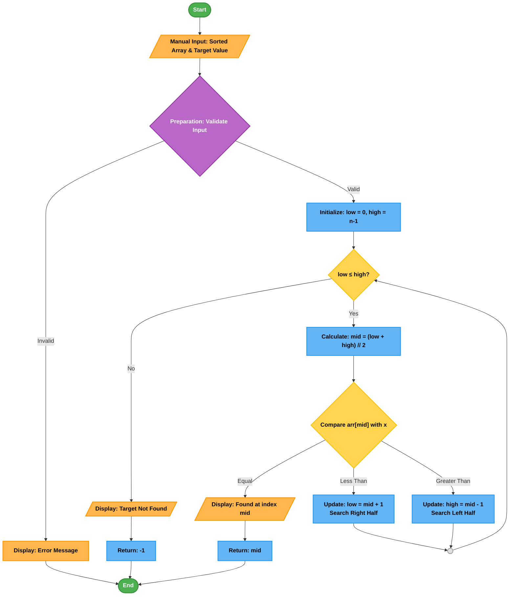

# Binary Search Algorithm Visualizer

## Demo Video/GIF/Screenshot

*(Replace this section with your actual visual materials)*

**Demo GIF:**
<!--  -->

**Screenshots:**
<!-- 
 -->

**Video Demo:** [Link to video recording if available]

## Problem Breakdown & Computational Thinking

### Algorithm Overview
Binary Search is an efficient searching algorithm that finds the position of a target value within a **sorted array**. It works by repeatedly dividing the search interval in half, comparing the middle element with the target value, and eliminating half of the remaining elements at each step.

### Computational Thinking Approach

#### 1. **Decomposition**
Breaking Binary Search into smaller steps:
- **Step 1:** Receive sorted array and target value as input
- **Step 2:** Initialize pointers: `low = 0`, `high = len(array) - 1`
- **Step 3:** While `low <= high`:
  - Calculate `mid = (low + high) // 2`
  - Compare `array[mid]` with target:
    - If equal: return `mid` (found)
    - If less: update `low = mid + 1` (search right half)
    - If greater: update `high = mid - 1` (search left half)
- **Step 4:** Return `-1` if not found

#### 2. **Pattern Recognition**
- Repeated halving of search space (divide-and-conquer)
- Systematic comparison at midpoint
- Progressive narrowing of search boundaries
- Logarithmic time complexity: O(log n)

#### 3. **Abstraction**
**Shown to user:**
- Current search boundaries (low, high pointers)
- Midpoint calculation and comparison
- Visual highlighting of compared elements
- Step-by-step progression through algorithm
- Final result (position or "not found")

**Hidden from user:**
- Underlying array indexing details
- Mathematical floor division
- Loop control variables
- Memory allocation details

#### 4. **Algorithm Design**
**Input → Processing → Output Flow:**

### Flowchart Symbol Key
The following symbols are used in the Binary Search algorithm flowchart:


| Symbol | Name | Purpose | Used in Binary Search For |
|--------|------|---------|---------------------------|
| `([Start/End])`<br> | **Terminator** | Beginning and end points | Starting the search and ending when complete |
| `[/.../]`<br> | **Manual Input/Display** | User input or output display | Receiving sorted array/target; displaying results |
| `[...]`<br> | **Process/Operation** | Algorithm steps and calculations | Initializing pointers, calculating midpoint |
| `{...?}`<br> | **Decision/Branching** | Conditional checks | Checking loop condition, comparing values |
| `((...))`<br> | **Connector** | Connecting flow segments | Looping back to repeat search |

### Color & Contrast Guide:

| Color | Element Type | Text Color | Purpose |
|-------|--------------|------------|---------|
|  **Green** | Terminator | **White** | Start/End points - high visibility |
|  **Orange** | Input/Output | **Black** | User interaction points |
|  **Blue** | Process | **White** | Core algorithm operations |
|  **Yellow** | Decision | **Black** | Comparisons and branching |
|  **Light Green** | Display | **Black** | Results and output |
|  **White** | Connector | **Black** | Flow connections |

### Binary Search Specific Examples:

| Step | Symbol | Description |
|------|--------|-------------|
| 1 | `([Start])` | Algorithm begins |
| 2 | `[/Sorted Array: 1,3,5,7,9/]` | User inputs data |
| 3 | `[Initialize: low=0, high=4]` | Set up search boundaries |
| 4 | `{low ≤ high?}` | Check if search should continue |
| 5 | `[Calculate: mid = (0+4)//2 = 2]` | Find midpoint |
| 6 | `{arr[2] = target?}` | Compare middle element |
| 7 | `[/Found at index 2/]` | Display successful result |
| 8 | `((Loop))` | Return to step 4 |
| 9 | `([End])` | Algorithm completes |

**Note:** All symbols use high-contrast color combinations (light text on dark backgrounds, dark text on light backgrounds) for maximum readability.

### Flow Chart:



### Steps to Run:

## Prerequisites
- Python 3.7 or higher
- pip (Python package installer)

## Installation Steps

# 1. Clone the repository:

```bash
git clone https://github.com/juswamacbook/CISC121-_Final-Project.git
cd CISC121-_Final-Project
```

# 2. Install required dependencies:
```
bash
pip install -r requirements.txt
```

# 3. Run the application:

```
bash
python app.py
```
# 4. Access the app:

- Open your web browser

- Navigate to: http://localhost:7860

- Or click the link provided in the terminal

## Using the Application

# Input Section:

- Enter a comma-separated list of numbers (e.g., 1, 3, 5, 7, 9, 11)

- Enter a target value to search for

- Click "Search" button

# Visualization:

- Watch the step-by-step search process

- See color-coded elements:

    - Red: Current search boundaries

    - Blue: Current midpoint being compared

    - Green: Found target element

- Follow the algorithm logic in real-time

# Output:

- Result displayed: Position index or "Not Found"

- Number of steps taken

- Time complexity explanation

## Testing & Verification

# Test Cases Performed
# Test Cases Performed

| Test Case      | Input Array            | Target | Expected Result | Status |
|----------------|------------------------|--------|-----------------|--------|
| Normal Case    | [1, 3, 5, 7, 9, 11]    | 7      | Index 3         | ✓      |
| First Element  | [2, 4, 6, 8, 10]       | 2      | Index 0         | ✓      |
| Last Element   | [1, 2, 3, 4, 5]        | 5      | Index 4         | ✓      |
| Not Found      | [10, 20, 30, 40]       | 25     | -1              | ✓      |
| Empty Array    | []                     | 5      | -1              | ✓      |
| Single Element | [42]                   | 42     | Index 0         | ✓      |
| Large Array    | 1-1000                 | 777    | Index 776       | ✓      |

# Edge Cases Handled
- ✅ Empty input arrays

- ✅ Single-element arrays

- ✅ Target not in array

- ✅ Non-numeric inputs (error handling)

- ✅ Unsorted arrays (with sorting reminder)

# Verification Methods
1. Manual Testing: Multiple test runs with varied inputs

2. Unit Tests: Basic test functions included in code

3. Visual Verification: Step-by-step visualization confirms logic

4. Complexity Analysis: Confirms O(log n) behavior

### Hugging Face Link
- Live Application: [Your Hugging Face Space Link Here]
(Once deployed, replace with your actual Hugging Face URL)

## To deploy on Hugging Face:

- Create a Hugging Face account

- Create a new Space

- Choose "Gradio" as SDK

- Upload your files: app.py, requirements.txt

Your app will be available at: https://huggingface.co/spaces/[your-username]/[app-name]

## Features & Implementation Details

# Algorithm Implementation
```
python
def binary_search(arr, target):
    """
    Perform binary search on a sorted array.
    
    Args:
        arr: Sorted list of numbers
        target: Number to search for
    
    Returns:
        Index of target if found, -1 otherwise
    """
    low, high = 0, len(arr) - 1
    steps = []
    
    while low <= high:
        mid = (low + high) // 2
        steps.append((low, mid, high, arr[mid]))  # Record step for visualization
        
        if arr[mid] == target:
            return mid, steps  # Found
        elif arr[mid] < target:
            low = mid + 1  # Search right half
        else:
            high = mid - 1  # Search left half
    
    return -1, steps  # Not found
```
## Gradio Interface Features
- Input Validation: Ensures sorted array requirement

- Step-by-Step Visualization: Animated progression

- Color Coding: Visual distinction of algorithm states

- Educational Labels: Clear explanations of each step

- Responsive Design: Works on different screen sizes

## Key Python Libraries Used
- Gradio: For creating the web interface

- Matplotlib/Plotly: For visualization (if used)

- Time: For step delays in visualization

### Author & Acknowledgment

Author: Joshua M. Ranin

Student ID: [204567769]

Course: CISC-121

Institution: Queen's University

## Acknowledgments

- Course instructor and TAs for project guidance

- Gradio team for the excellent UI library

- Hugging Face for free app deployment

- Visualgo for algorithm visualization inspiration

## References

1. Binary Search Algorithm - GeeksforGeeks

2. Gradio Documentation: https://www.gradio.app/docs/

3. Hugging Face Spaces Guide

4. CISC-121 Course Materials

## **How to Use This:**

1. **Save as `README.md`** in your GitHub repository root

2. **Fill in the placeholder sections:**

   - Your name and student ID in "Author" section
     
   - Add actual demo media (GIFs/screenshots)
     
   - Add your Hugging Face link once deployed
     
4. **Add your actual `app.py` code** when ready
   
6. **Create `requirements.txt`** with: `gradio`

## Project Structure

CISC121-_Final-Project/
├── README.md # This documentation file
├── app.py # Main application file
├── requirements.txt # Python dependencies
├── demo/ # Optional: Demo media files
│ └── binary-search-demo.gif
└── screenshots/ # Optional: Screenshot images
├── screenshot1.png
└── screenshot2.png


