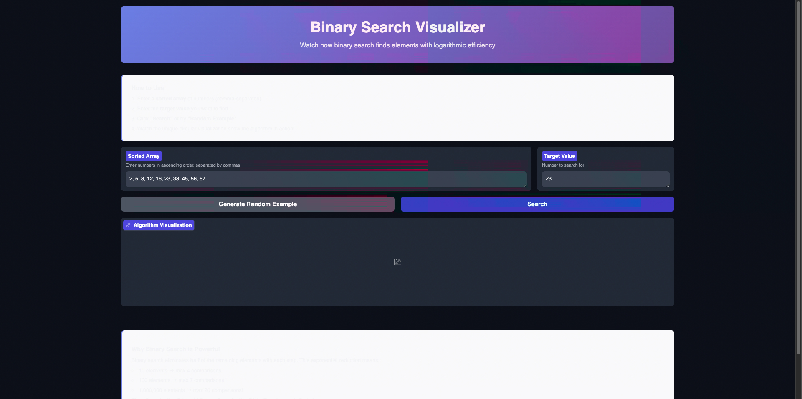
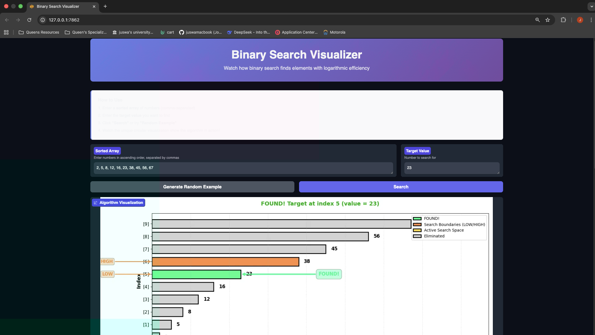
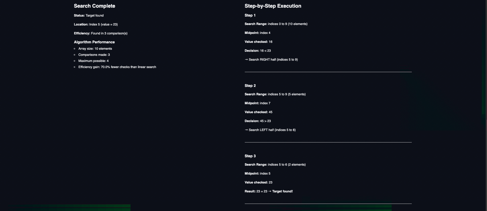
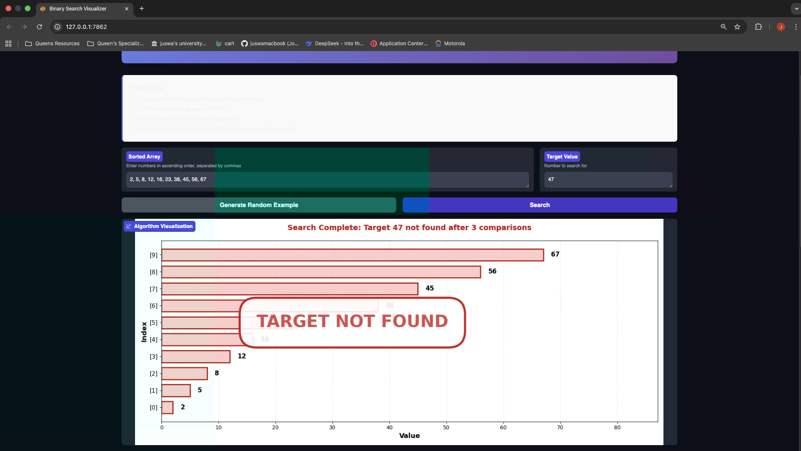
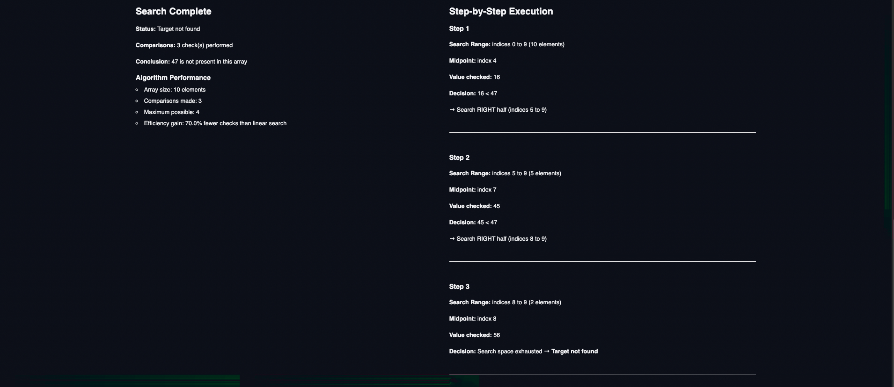
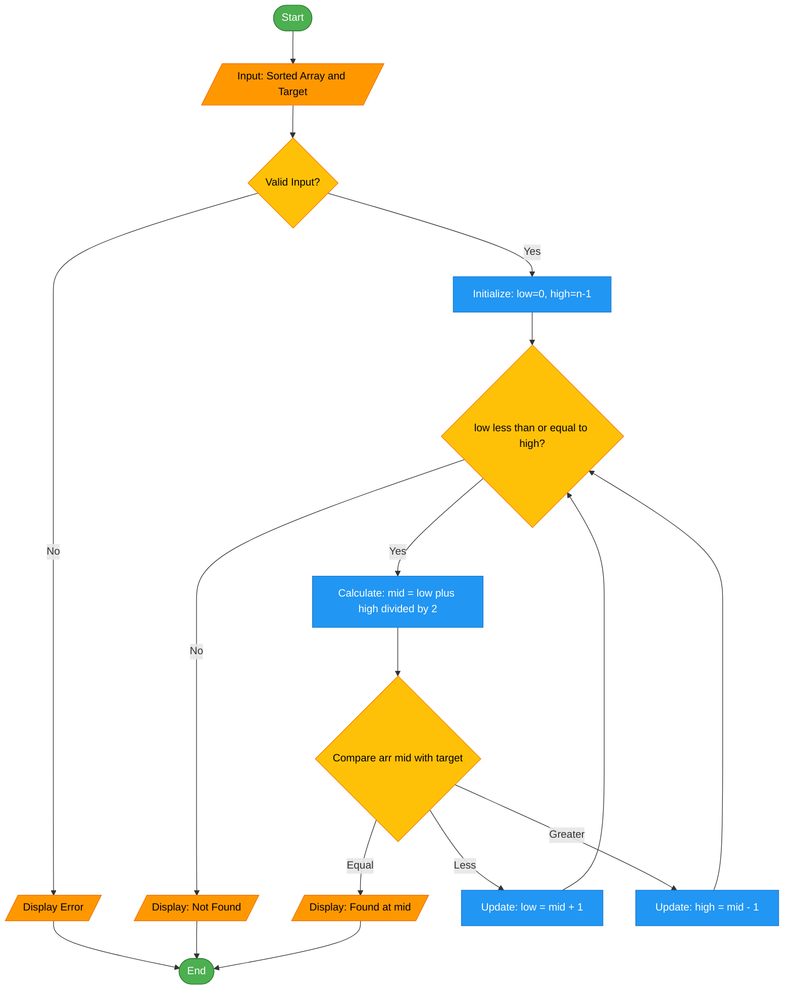

# Binary Search Algorithm Visualizer

## Demo Video//Screenshot

**Screenshots:**






**Video Demo:** [(~/demo.mov)]

---

## Problem Breakdown & Computational Thinking

### Algorithm Overview
Binary Search is an efficient searching algorithm that finds the position of a target value within a **sorted array**. It works by repeatedly dividing the search interval in half, comparing the middle element with the target value, and eliminating half of the remaining elements at each step.

### Computational Thinking Approach

#### 1. Decomposition
The search algorithm will be broken down into these smaller steps:

- Input Acquisition: Collect the unsorted data from the user via GUI input fields

- Data Validation: Verify input format and convert to appropriate data structure

- Visual Initialization: Display initial unsorted array with visual representation

- Sorting Iteration: Perform the core comparison/swapping operations

- Visual Update: Animate each step to show algorithm progress

- Completion Check: Determine when sorting is complete

- Output Display: Show final sorted result with performance metrics

#### 2. Pattern Recognition
The algorithm exhibits these repeating patterns:

- Comparison Pattern: Repeatedly comparing adjacent elements (in bubble sort) or finding minimum/maximum elements (in selection sort)

- Swapping Pattern: Exchanging positions when elements are out of order

- Iterative Reduction: With each pass, the sorted portion grows and unsorted portion shrinks

- Index Traversal: Systematic movement through the data structure from start to end

#### 3. Abstraction
**Details to Show User:**

- Current state of the array/list after each significant operation

- Visual highlighting of elements being compared

- Animation of element swaps/movements

- Step counter and current algorithm phase

- Performance metrics (comparisons, swaps, time)

**Details to Hide/Abstract:**

- Internal pointer/index management

- Temporary variable assignments during swaps

- Loop control variables and conditions

- Memory allocation/management details

- Error handling for edge cases (handled silently)
#### 4. Algorithm Design

**Input:**
- Data Type: String input from text field (e.g., "5, 3, 8, 1, 2")

- Conversion: Parse to integer list: [5, 3, 8, 1, 2]

- GUI Elements: Text input field, "Sort" button, algorithm selection dropdown
**Output:**
- Visual: Animated sorted array with color-coded completion

- Textual: Final sorted list displayed in result area

- Metrics: Statistics panel showing:

- Total comparisons made

- Total swaps performed

- Time elapsed

- Algorithm efficiency rating


**Choice of Data Structure**
- Primary Structure: Python List (dynamic array)

- Reasoning: Easy indexing for visualization, simple swapping operations, familiar to users

- Alternative Considered: Linked List (but less intuitive for array visualization)

---

### Flowchart



---

## Installation & Setup

### Prerequisites
- Python 3.7 or higher
- pip (Python package installer)

### Installation Steps

1. **Clone the repository:**
```bash
git clone https://github.com/juswamacbook/CISC121_Final_Project.git
cd CISC121_Final_Project
```

2. **Create a virtual environment (recommended):**
```bash
python -m venv venv
source venv/bin/activate  # On Windows: venv\Scripts\activate
```

3. **Install dependencies:**
```bash
pip install -r requirements.txt
```

4. **Run the application:**
```bash
python app.py
```

5. **Access the app:**
- Open your web browser
- Navigate to: http://localhost:7860
- Or click the link provided in the terminal

---

## Using the Application

### Input
1. Enter a comma-separated list of sorted numbers (e.g., `1, 3, 5, 7, 9, 11`)
2. Enter a target value to search for
3. Click "Run Binary Search" button

### Visualization
- Watch the step-by-step search process
- Color-coded elements show algorithm state:
  - **Red (L/H):** Current search boundaries
  - **Blue (M):** Current midpoint being compared
  - **Green (M):** Found target element

### Output
- Search result: Position index or "Not Found"
- Number of comparisons made
- Step-by-step execution trace
- Algorithm efficiency metrics

---

## Testing & Verification

### Test Cases Performed

| Test Case      | Input Array            | Target | Expected Result | Status |
|----------------|------------------------|--------|-----------------|--------|
| Normal Case    | [1, 3, 5, 7, 9, 11]    | 7      | Index 3         | ✓      |
| First Element  | [2, 4, 6, 8, 10]       | 2      | Index 0         | ✓      |
| Last Element   | [1, 2, 3, 4, 5]        | 5      | Index 4         | ✓      |
| Not Found      | [10, 20, 30, 40]       | 25     | -1              | ✓      |
| Single Element | [42]                   | 42     | Index 0         | ✓      |

### Edge Cases Handled
- Empty input arrays
- Single-element arrays
- Target not in array
- Non-numeric inputs (error handling)
- Unsorted arrays (error message)
- Array size limits (max 20 elements)

### Verification Methods
1. **Manual Testing:** Multiple test runs with varied inputs
2. **Visual Verification:** Step-by-step visualization confirms logic
3. **Complexity Analysis:** Confirms O(log n) behavior

---

## Algorithm Implementation

### Core Binary Search Function

```python
def binary_search(arr, target):
    """
    Implements binary search algorithm iteratively.
    Time Complexity: O(log n)
    Space Complexity: O(1)
    """
    steps = []
    low = 0
    high = len(arr) - 1
    
    while low <= high:
        mid = (low + high) // 2
        steps.append({'low': low, 'high': high, 'mid': mid})
        
        if arr[mid] == target:
            return mid, steps  # Found
        elif arr[mid] < target:
            low = mid + 1      # Search right half
        else:
            high = mid - 1     # Search left half
    
    return -1, steps           # Not found
```

### Key Features
- **Input Validation:** Ensures sorted array requirement
- **Step-by-Step Visualization:** Real-time algorithm progression
- **Color Coding:** Visual distinction of algorithm states
- **Educational Output:** Clear explanations of each step
- **Responsive Design:** Works on different screen sizes

---

## Key Python Libraries Used

- **Gradio:** Web interface and user interaction
- **Matplotlib:** Bar chart visualization
- **NumPy:** Efficient array operations and calculations

---

## Deployment

### Hugging Face Spaces
Live Application: [Your Hugging Face Space Link]

### To Deploy:
1. Create a Hugging Face account at https://huggingface.co
2. Create a new Space and select "Gradio" as SDK
3. Upload `app.py` and `requirements.txt`
4. Your app will be live at: `https://huggingface.co/spaces/03nineteenjo/`

---

## Project Structure

```
CISC121_Final_Project/
├── README.md              # Project documentation
├── app.py                 # Main application file
├── requirements.txt       # Python dependencies
├── demo/                  # Demo media files
│   └── binary-search-demo.gif
└── images/           # Screenshot images
    ├── screenshot1.png
    └── screenshot2.png
```

---

## Author & Acknowledgments

**Author:** Joshua M. Ranin  
**Student ID:** 20457769  
**Course:** CISC-121  
**Institution:** Queen's University  
**Date:** December 2024

### Acknowledgments
- Course instructor and TAs for project guidance
- Gradio team for the excellent UI library
- Hugging Face for free app deployment

---

## References

1. [Binary Search Algorithm - GeeksforGeeks](https://www.geeksforgeeks.org/binary-search/)
2. [Gradio Documentation](https://www.gradio.app/docs/)
3. [Hugging Face Spaces Guide](https://huggingface.co/docs/hub/spaces)
4. CISC-121 Course Materials

---

## License

This project is created for educational purposes as part of CISC-121 coursework at Queen's University.